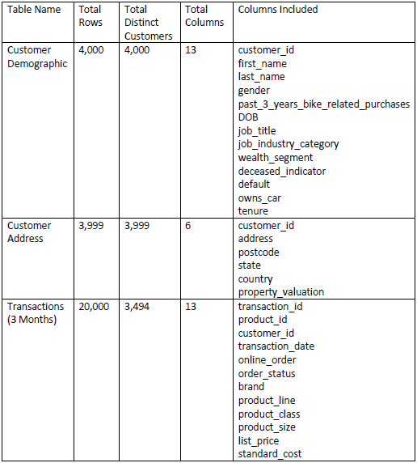

# SME Sales Case Study

This project (brief description)

Inspiration, and the data used, for this project came from the KPMG Data Analytics Virtual Experience Program on [Forage](https://www.theforage.com/virtual-internships/theme/m7W4GMqeT3bh9Nb2c/KPMG-Data-Analytics-Virtual-Internship?ref=oiP3eujQmJmMY5YfG). A powerpoint presentation covering the entire project can be found [here].

## Data Quality Assessment

### Brief

*Sprocket Central Pty Ltd , a medium size bikes & cycling accessories organisation, has approached Tony Smith (Partner) in KPMG’s Lighthouse & Innovation Team. Sprocket Central Pty Ltd  is keen to learn more about KPMG’s expertise in its Analytics, Information & Modelling team.*

*Primarily, Sprocket Central Pty Ltd needs help with its customer and transactions data. The organisation has a large dataset relating to its customers, but their team is unsure how to effectively analyse it to help optimise its marketing strategy.*

*The client provided KPMG with 3 datasets:*

- *Customer Demographic*
- *Customer Addresses*
- *Transactions data in the past 3 months*

*As well as a new customer list to employ a targeted sales startegy on, later on in the project.*

*You decide to start the preliminary data exploration and identify ways to improve the quality of Sprocket Central Pty Ltd’s data.*

### Task
Explore the data and draft an email to the client identifying the data quality issues and strategies to mitigate these issues.

This towards data science blog [post](https://towardsdatascience.com/the-six-dimensions-of-data-quality-and-how-to-deal-with-them-bdcf9a3dba71) was used as a framework to identify and measure data quality issues.

Pre-Cleaning Table Stats

Identified Data Quality Issues
![Identified Data Quality Issues]

Post-Cleaning Table Stats
![Post-Cleaning Table Stats}

A detailed description of data quality issues, and mitigatiion actions, can be found [here] in the draft email for task 1.

Having cleaned the data, some preliminary insights into the three datasets were visualised in Power BI.

## Data Insights

Having read [this](https://towardsdatascience.com/cluster-then-predict-for-classification-tasks-142fdfdc87d6) towards data science post, I looked to combine previously learnt clustering analysis techniques with classification to identify which of the new customers posed the greatest potential value.

## Dashboard Presentation
